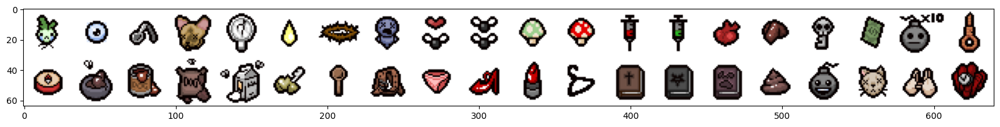
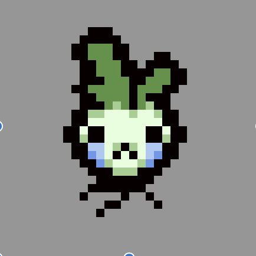
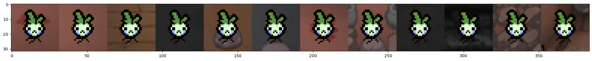
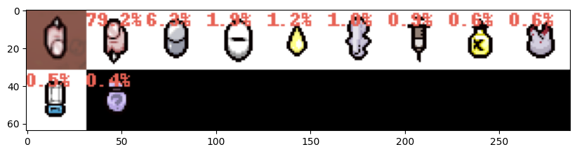
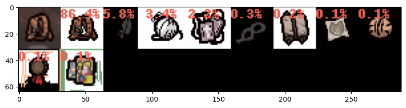
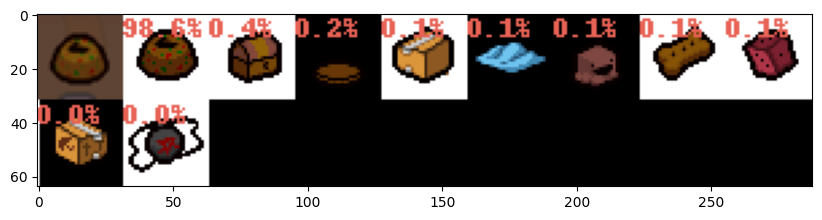

# 引言  


最近在玩《以撒的结合:忏悔》, ns版本. 游戏确实上头好玩, 内容很多. 但是游玩下来遇到一个纠结头疼的问题就是, 道具/ 装备 有时候捡起来后的效果, 还不如不捡. 装备/道具只会在捡起来的时候才能看到道具和状态是什么, 甚至, 有时候捡起来后描述也看不出这个道具到底能用来干嘛,  魂系叙事那一套......虽然也找到不错的[以撒的结合中文维基](https://isaac.huijiwiki.com/wiki/%E9%A6%96%E9%A1%B5), 但是, 站点只能文字搜索, 再加上其道具和饰品加起来总数量有900多个, 相当于ImageNet的种类了. 
于是就想到, 干脆做一个“以撒道具图像识别功能” 好了, 优化体验: ) .   


---  


# 自定义训练数据图像识别

得益于各种深度学习框架的发展, 现在训练一个模型变得非常简单, 于是我就决定直接用`pytorch`来完成这个图片识别的任务了.  考虑到以撒的道具装备这类东西图像数据是非常**垂直领域**了, 所以我需要准备对应的训练数据进行模型的训练.  
# 数据准备   

## 数据获取&数据合成   

从[以撒的结合中文维基](https://isaac.huijiwiki.com/wiki/%E9%A6%96%E9%A1%B5) 编写爬虫把道具/装备的图片数据, 描述都抓取下来.  
爬虫比较简单, 主要就是图片爬取的时候, 需要从css中把sprite图子图的x, y提取出来, 然后自行使用sprite划分独立的道具图. 下图为css和html标签中抽取出来的信息
```python
{'collectibles_001': {'x': 32,
  'y': 0,
  'en': 'The Sad Onion',
  'zh': '悲伤洋葱',
  'level': '1',
  'type': '道具',
  'level2': '3',
  '?': '/',
  'desc': '射速上升。',
  'new_id': 0,
  'image': './cus_data/0.png'}, ...
} # 提取出每个道具的图片和其他属性
```

然后把图片分割后某个目录, 此处我是把裁切好的图片存放在 `./cus_data`下. 并且把图片. 整理后得到训练的类别标签备用.
```python
>>>classes
{0: '悲伤洋葱:射速上升。',
 1: '内眼:角色每次发射3颗泪弹。',
 2: '弯勺魔术:角色的泪弹获得追踪效果。',
 3: '柯吉猫的头:泪弹变大，击退效果上升，伤害上升。',
 4: '我的镜像:角色的泪弹会飞回角色身边。',
 5: '小号:射程下降，射速上升。',
 ...
```

此处我把图片裁剪下来的32x32大小的图片保存为合成训练数据的元数据, 因为是像素风格, 所以哪怕所缩小了,只要不使用平滑, 那还是非常清晰的.
  
(数据获得和处理完整代码在末尾的引用中会给出链接.)
## 数据增强   

实际的预测情况都伴随着各种各样的背景干扰,  所以这边需要在合成训练数据的时候, 也需要让这些元图标拥有各种各样的背景.

另一方面, 考虑到一个场景就是使用摄像头的拍照的时候, 可能会有的一些图像的畸变和变形等. transform中也需要配置数据增强的操作, 包括但不限于, 抖动, 明暗度变化等.
```python
from torchvision.transforms import ToTensor

transform = transforms.Compose(
    [
        transforms.Lambda(lambda x: x.float()),
    ]) # 先直接配置一个用来计算 数据均值和标准差,以方便正则化

# 配置初始的dataloader用于遍历和计算均值和标准差
from torchvision.io import read_image

class IssacCustomDatasets(Dataset):
    def __init__(self, img_sort_files, 
                 img_dir, transform=None, 
                target_transform=None):
        self.img_labels = img_sort_files
        # 自定义标签关系, 此处需要排好序的
        self.img_dir = img_dir
        self.transform = transform
        self.target_transform = target_transform
        
    def __len__(self):
        return len(self.img_labels)

    def __getitem__(self, idx):  # 作用是获得label 和 item 即可
        filename = self.img_labels[idx]        
        img_path = os.path.join(self.img_dir, filename)
        image = read_image(img_path, mode=torchvision.io.image.ImageReadMode.RGB)

        label = int(filename.split(".")[0])
        if self.transform:
            image = self.transform(image)
        if self.target_transform:
            label = self.target_transform(label)
        return image, label

from_dir = "new_cus_data"
need_move_images = os.listdir("new_cus_data/")
need_move_images = [i for i in need_move_images if int(i.split(".")[0]) ]
need_move_images.sort(key=lambda x: f"{int(x.split('.')[0]):03d}" + f"{x.split('.')[1]}")
print(len(need_move_images))

train_dataset = IssacCustomDatasets(img_sort_files=need_move_images, img_dir="new_cus_data/",
                                    transform=transform)

## dataloader
train_dataloader = DataLoader(train_dataset, 
                              batch_size=batch_size, 
                              shuffle=True)

# 获取图片数据的 归一化数值
global_mean = []
global_std = []
for images, labels in train_dataloader:
    numpy_image = images.numpy()
    batch_mean = np.mean(numpy_image, axis=(0,2,3))
    batch_std = np.std(numpy_image, axis=(0,2,3))
    global_mean.append(batch_mean)
    global_std.append(batch_std)

global_mean = np.mean(global_mean, axis=0).tolist()
global_std = np.mean(global_std, axis=0).tolist()
print(global_mean)
print(global_std)
```

再次根据得到的均值和标准差更新训练用的dataloader
```python
from torchvision.transforms import ToTensor
        
transform = transforms.Compose(
    [
        transforms.RandomAffine(degrees=0, translate=None, scale=(0.9, 1.1), shear=None),  
        # 随机放大或者缩小一点点
        # 增加噪声, 防止过拟合
        transforms.ColorJitter(
            brightness=0.1,
            contrast=0.1,
            saturation=0.1,
            hue=0.1),  # 抖动图像的亮度、对比度、饱和度和色相
        transforms.Lambda(lambda x: x.float()),
        transforms.Normalize(
            global_mean,
            global_std
        )  # 对图片数据做正则化
    ])

train_dataset = IssacCustomDatasets(need_move_images, img_dir="new_cus_data/", transform=transform)

## dataloader
train_dataloader = DataLoader(train_dataset, 
                              batch_size=batch_size, 
                              shuffle=True)
```

# 训练模型  

## 自定义模型   

因为图片识别任务输入的图片比较简单, 所以我这儿直接用vgg16来训练一个小模型就可以了. 原版的vgg16是基于244x244的ImageNet的图片输入, 此处我通过继承调整了池化层的7x7的特征图的输入, 以让他支持32x32的输入还有最后的全连接层的输出.
```python
import torch
from torch import nn
from torchvision.models import vgg16
import torch.optim as optim
import numpy as np

device = (
    "cuda"
    if torch.cuda.is_available()
    else "mps"
    if torch.backends.mps.is_available()
    else "cpu"
)
print(f"Using {device} device")

total_classes = list(set([i.split(".")[0] for i in need_move_images]))
total_classes_num = len(total_classes)

## 大批量测试
from matplotlib import pyplot as plt
from torchvision.utils import make_grid

class VGG16_S(nn.Module):
    def __init__(self, num_classes):
        super(VGG16_S, self).__init__()
        model = vgg16(pretrained=True)  # 可以选择False 和True 
        self.features = model.features  # 只取了feature
        self.classifier = nn.Sequential(
            nn.Linear(512 * 1 * 1, 4096),  # 修改此处的第一个参数用来适配64*64
            nn.ReLU(True),
            nn.Dropout(),
            nn.Linear(4096, 4096),
            nn.ReLU(True),
            nn.Dropout(),
            nn.Linear(4096, num_classes),
        )
        
    def forward(self, x):
        x = self.features(x)
        x = x.view(x.size(0), -1) 
        x = self.classifier(x)
        return x
      
```

## 训练识别模型    

使用多个不同背景合成的训练数据和数据增强后, 我们获得了 10872 的总训练数据, 921个类. 然后就可以进行相关的训练了. (数据量实在不算太多, 所以偷懒直接回抽样训练数据验证好了)

```python
%%time
# 训练模型

net = VGG16_S(num_classes=total_classes_num).to(device)  # 这次训练64 * 64的版本

criterion = nn.CrossEntropyLoss()
optimizer = optim.Adam(net.parameters(), lr=0.0001, weight_decay=0.01)  # 加入了l2正则化

check_iter = 10 # train check batch size 
train_epoch = 25
prefix = f"20240128_full_32x32_clear_{total_classes_num}class_l2_2-"

print("batch_size", batch_size)
for epoch in range(train_epoch):
    net.train()  # 每个epoch 后切换训练模式, 那么会不会保d留之前的训练权重呢?
    
    progress_bar = tqdm(enumerate(train_dataloader, 0), total=len(train_dataloader))
    for i, data in progress_bar:
        inputs, labels = data  # 必须要float 归一化? 浮点类型.
        inputs, labels = inputs.float().to(device), labels.to(device)

        optimizer.zero_grad()
        outputs = net(inputs)  # 这一步, 运行有问题, 这是为什么呢, 检查一下图片格式

        loss = criterion(outputs, labels)
        loss.backward()
        optimizer.step()
        progress_bar.set_description(f'epoch:{epoch}, loss: {loss / batch_size:.3f}')
    
    if epoch % 1 == 0:  # 每两个epoch进行一次验证
        print("开始验证....")
        net.eval()
        correct = 0  # 记录正确预测的数量
        total = 0  # 总的样本数
        with torch.no_grad():
            
            progress_bar2 = tqdm(enumerate(train_dataloader, 0), total=int(len(train_dataloader) * 0.4))
            for i, data in progress_bar2:
                if i >= int(len(train_dataloader) * 0.4):
                    break
                inputs, labels = data
                inputs, labels = inputs.float().to(device), labels.to(device)
                outputs = net(inputs)
                _, predicted = torch.max(outputs.data, 1)

                total += labels.size(0)  # 实际的样本数
                correct += (predicted == labels).sum().item()  # 正确预测的样本数
        
        accuracy = round(correct / total * 100, 3)  # 计算准确率
        print(f'epoch: {epoch}, Accuracy: {accuracy:.3f}')
        if accuracy >= 60:  # 太小的根本没比较保存
            save_model_path = f"{prefix}_vgg16_{epoch}_{accuracy}.pth"
            torch.save(net.state_dict(), save_model_path)
            print(f"model save: ", save_model_path)
        
    torch.cuda.empty_cache()
print('Finished Training')

save_model_path = f"{prefix}_vgg16_{epoch}_{accuracy}.pth"
torch.save(net.state_dict(), save_model_path)
print(f"model save: ", save_model_path)
```

# 验证训练成果   

经过多次训练验证, 最终设置25epoch, 每轮保存结果后, 得到了多个90以上准确率的结果, 这之后我还让他训练了额外的10轮, 但是准确率都没有再提升,反而突下降了, 说明后续更多的epoch就是过拟合了, 不需要再增加轮数.  
最终我才用了16 epoch的模型结果: 
```
epoch: 16, Accuracy: 98.001
model save:  20240128_full_32x32_clear_906class_l2_2-_vgg16_16_98.001.pth
```

## 验证代码   

读取模型, 并且使用手机拍照的截图, 并使用真实图片进行验证:
```python

model_path = "20240128_full_32x32_clear_906class_l2_2-_vgg16_16_98.001.pth"  # 这个效果也不错 19, 看第一/第二个

model = VGG16_S(num_classes=total_classes_num).to(device) 
model.load_state_dict(torch.load(model_path))

def get_real_label(class_index):
    return label_dict[class_index]

def eval_predict(model, image_path):
    image = read_image(image_path, mode=torchvision.io.image.ImageReadMode.RGB)
    inner_transform = transforms.Compose(
    [
        transforms.Resize((32, 32)), 
        transforms.ColorJitter(
            brightness=0.1,
            contrast=0.1,
            saturation=0.1,
            hue=0.1),  # 抖动图像的亮度、对比度、饱和度和色相
        transforms.Lambda(lambda x: x.float()),
        transforms.Normalize(
            global_mean,
            global_std
        )  # 对图片数据做正则化
    ])
    model.eval()
    timg = inner_transform(image)
    timg = timg.to(device)
    timg1 = timg.unsqueeze(0)
    result = model(timg1)
    _, predicted = torch.max(result, 1)
    get_real_label(predicted.item())
    return result, predicted```

## 验证结果可视化   

推理, 并且得到前10个最像的类型, 优化用户体验. 因为训练数据有限, 所以才用增加召回数量和显示各个种类识别率的形式给用户选择.毕竟,本质是方便用户识别道具类型.  
```python
import torch.nn.functional as F
from PIL import Image, ImageDraw, ImageFont

real_test_images = [i for i in os.listdir("cus_test_data/") if i.find(".") != 0]
print(len(real_test_images))

for t_image_path in real_test_images:
    print("real label: ", image_path.split("/")[-1])    
    
    t_image_path = os.path.join("cus_test_data", t_image_path)
    t_image = Image.open(t_image_path)
    t_image = t_image.resize((32, 32))
    result, predicted = eval_predict(model, t_image_path)

    probabilities = F.softmax(result, dim=1)  
    values, indices = torch.topk(probabilities, 10)
    match_images = [t_image]
    for p, i in zip(values[0].tolist(), indices[0].tolist()):
        data = get_real_label(i)
        print(f"{data['en']} {data['zh']}: {round(100*p, 2)}%")
        match_img = Image.open(data.get("image"))
        # 创建一个可以在给定图像上绘图的对象
        draw = ImageDraw.Draw(match_img)
        # 字体颜色
        font_color = (232,98,85)
        # 绘制文本
        draw.text((0, 0), f"{round(100*p, 1)}%", fill=font_color)
        match_images.append(match_img)
        
    plot_images(match_images, figsize=(10, 10))
    print()
    print("----------------------------------------------")
```



   

# 换用ResNet网络训练对比  
```python
%%time
# 训练模型

# 加载ResNet101模型
net = torchvision.models.resnet101(pretrained=True)
num_features = net.fc.in_features

# 增加 dropout
net.fc = torch.nn.Sequential(
    torch.nn.Dropout(0.5),   # 增加 dropout避免太快过拟合
    torch.nn.Linear(num_features, total_classes_num)
)
# 单层卷积, 替代了vgg的4096个全连接层,深,但是速度还更快
net.to(device)

model.eval()  # 验证模块

criterion = nn.CrossEntropyLoss()
optimizer = optim.Adam(net.parameters(), lr=0.0001, weight_decay=0.01)  # 加入了l2正则化

check_iter = 10 # train check batch size 
train_epoch = 25
prefix = f"20240201_full_32x32_clear_{total_classes_num}class_l2_2-"

print("batch_size", batch_size)
for epoch in range(train_epoch):
    net.train()  # 每个epoch 后切换训练模式, 那么会不会保d留之前的训练权重呢?
    
    progress_bar = tqdm(enumerate(train_dataloader, 0), total=len(train_dataloader))
    for i, data in progress_bar:
        inputs, labels = data  # 必须要float 归一化? 浮点类型.
        inputs, labels = inputs.float().to(device), labels.to(device)

        optimizer.zero_grad()
        outputs = net(inputs)  # 这一步, 运行有问题, 这是为什么呢, 检查一下图片格式

        loss = criterion(outputs, labels)
        loss.backward()
        optimizer.step()
        progress_bar.set_description(f'epoch:{epoch}, loss: {loss / batch_size:.3f}')
    
    if epoch % 1 == 0:  # 每两个epoch进行一次验证
        print("开始验证....")
        net.eval()
        correct = 0  # 记录正确预测的数量
        total = 0  # 总的样本数
        with torch.no_grad():
            
            progress_bar2 = tqdm(enumerate(train_dataloader, 0), total=int(len(train_dataloader) * 0.4))
            for i, data in progress_bar2:
                if i >= int(len(train_dataloader) * 0.4):
                    break
                inputs, labels = data
                inputs, labels = inputs.float().to(device), labels.to(device)
                outputs = net(inputs)
                _, predicted = torch.max(outputs.data, 1)

                total += labels.size(0)  # 实际的样本数
                correct += (predicted == labels).sum().item()  # 正确预测的样本数
        
        accuracy = round(correct / total * 100, 3)  # 计算准确率
        print(f'epoch: {epoch}, Accuracy: {accuracy:.3f}')
        if accuracy >= 60:  # 太小的根本没比较保存
            save_model_path = f"{prefix}_resnet101_{epoch}_{accuracy}.pth"
            torch.save(net.state_dict(), save_model_path)
            print(f"model save: ", save_model_path)
        
    torch.cuda.empty_cache()
print('Finished Training')

save_model_path = f"{prefix}_resnet101_{epoch}_{accuracy}.pth"
torch.save(net.state_dict(), save_model_path)
print(f"model save: ", save_model_path)


```

## ResNet模型验证  
得益于`ResNet`采用了跳跃链接, 损失值能够更好的在更深的网络中进行传递, 表现的效果就是训练更容易收敛了.

训练的输出如下, 可以看到resnet的收敛速度极快, 10个epoch以内就可以达到90%的准确率,, 而vggNet则要接近10个epoch是远远没法达到90%准确率的.  
ResNet准确性更高, 所以如果是实际应用产品的话, 可以直接不用管古老的历史包袱了, vgg当然也有它的标志性意义. 但是真实省事, 确实直接选模型挑选新一点的, 会少一些坑. 🤔 
```shell
epoch:4, loss: 0.005: 100%|███████████████████████████████████████████████████████████████████████████████████████████████████████| 85/85 [02:45<00:00,  1.95s/it]

开始验证....

100%|█████████████████████████████████████████████████████████████████████████████████████████████████████████████████████████████| 34/34 [00:17<00:00,  1.90it/s]

epoch: 4, Accuracy: 96.507
model save:  20240201_full_32x32_clear_906class_l2_2-_resnet101_4_96.507.pth
```

载入训练后模型, 使用上面vgg16验证的代码, 进行验证, 对比后发现, 整体的泛化能力, ResNet要更好, 很多VggNet没能稳定识别的验证图片, ResNet都能比较稳定的以比较高的识别率进行识别.  


# 总结   

一时兴起的小需求, 也很多小细节需要处理. 
大批量数据运行前, 需要先抽少一些类进行小批量的快速验证, 对模型和训练数据进行验证. 这次我就是先用20类进行验证, 之后才进行900多类的训练.   

一开始用vgg, 用的是224x224的图片输入, 后面为了提速.因为是像素画,只要不要平滑, 32x32也足够清晰, 所以就调整vgg结构, 方便进行增加更多的batch_size进行更快的训练.及时调整了输入图片的尺寸以后, 我的电脑训练起来也快了很多, 40多分钟就可以完成25轮 128batch_size的模型训练, 体验还不错!    

然后就是, 可以的话, 主动挑选更新的代码, 老的模型, 经典, 但是效果远不如新一些的模型.ResNet更快收敛, 更快训练(笑...)

[模型训练完整代码](https://github.com/realzhengyiming/isaac_tools/blob/main/simple_issac_item_recognition-%E5%85%A8%E9%87%8F%E8%AE%AD%E7%BB%83%E7%9A%84%E7%89%88%E6%9C%AC.ipynb)  
[数据获取和处理的完整代码](https://github.com/realzhengyiming/isaac_tools/blob/main/isaac_data_spider.py)
代码都在github上了.  
我要去玩游戏了, 以撒真好玩 : ) 
## 后续优化    

+ 增加一下真实的截图作为训练数据, 以进一步提高各个类别的准确度
+ 进一步增加一些其他的数据增强, 以更好的模拟真实的使用情况
- [x] 考虑换用其他模型(resnet替换验证, 改进的模型明显更好, 历史包袱应该早日丢弃.)
+ 部署模型到移动端, 封装成应用进行使用, 改训练目标检测模型.

