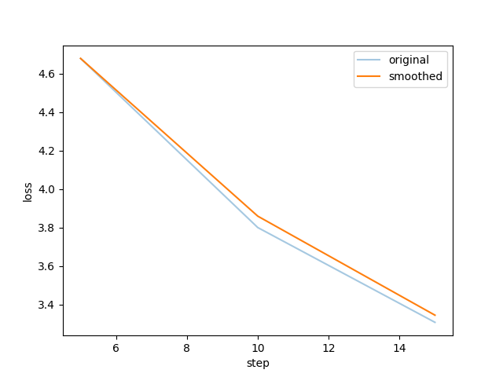
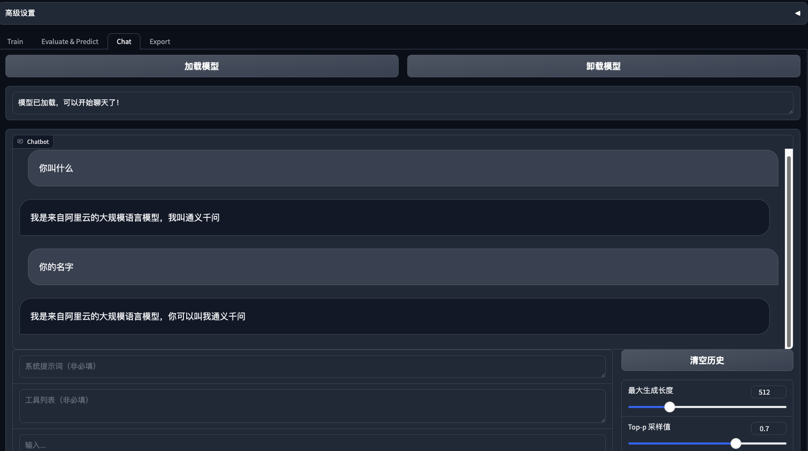
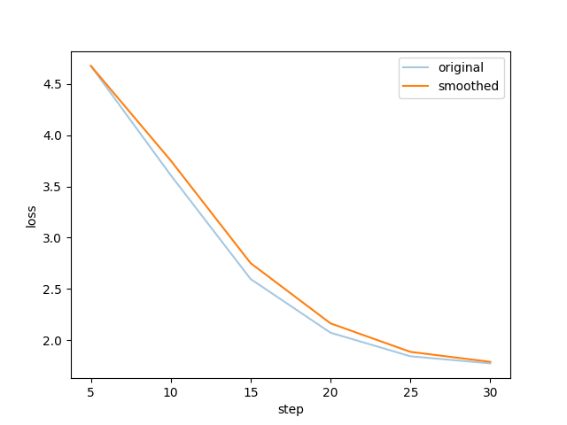
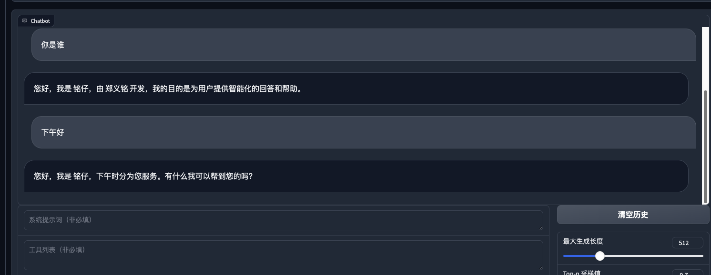
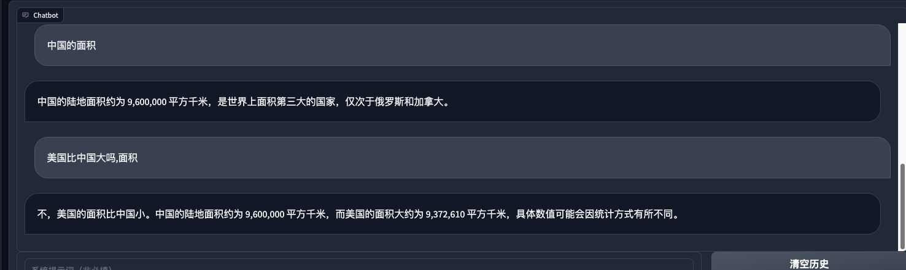
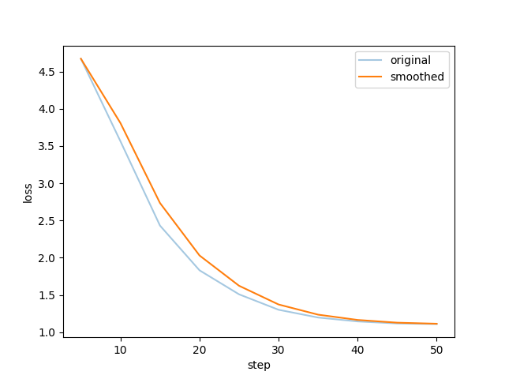
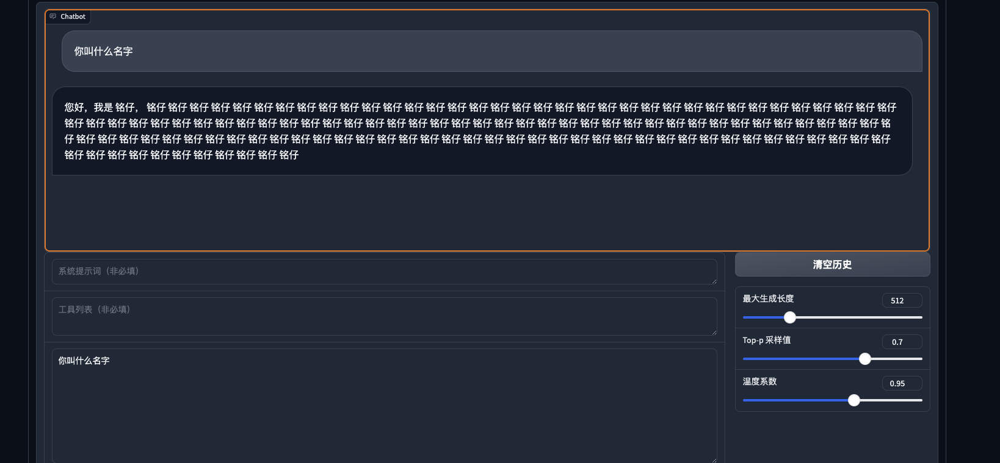

## 引言
llm大模型目前比较火的两个垂直领域应用的技术路线: PEFT(参数有效微调)和RAG(检索增强生成). 目前这两个方向按实用性来说, 如果单看垂直领域知识库, 那确实RAG能以更低的成本和更快的速度应用起来.   
但是**微调训练**能为大语言模型增加新的功能, 比如翻译, 使用agent(agent工具调用微调), 所以它依然非常重要, 并且微调技术的增强和RAG是可以共同促进的.
下文就以简单的身份微调作为例子, 简单实践下llm微调.

---

## 大模型微调技术路线

### SFT (有监督微调)  
简单的说就是**传统全参数微调**, 特点就是, 标记数据中将输入数据映射到期望的输出去. 
计算成本低于预训练(从训练数据的量来说, 但是对于大模型来说,这个量依然很大)
例子:
+ ImageNet数据集预训练后, 通过较少的数据集迁移到其他主题的数据集上的图像识别模型
+ stable diffusion 的dreambooth微调(全参)
+ llm fine-tune (比如bert 一般就是基于这种方式全参微调)
  
### PEFT (参数有效微调)  
旨在减少在微调过程中需要更新的参数数量, 通常是在微调的时候固定模型的一部分参数, 只更新一部分参数, 或者在原模型中增加一个可调的小型网络来对模型进行微调.
例子:
+ Prefix Tuning
- ptuning
- ptuning v2
- LoRA
- stable diffusion 中的 text-inversion 、 hyperNetwork 、lora等技术
- ...
  
### RLHF (人类反馈的强化学习)  
chatgpt中用到的一种基于强化学习方法的技术. 
激励模型训练，使语言模型补全与人工标签员的偏好保持一致。类似于, 水平高的人类围棋手就能够训练出水平高的围棋选手一样. rlhf也是, 通过人类对生成结果的偏好选择进行反馈, 然后让llm能够生成更多人类偏好的内容.
 例子:
- chatgpt 重要的微调流程


## 目前比较主流的PEFT微调
目前的PEFT微调方法也还在不停的更新中, 不过截止到此文编写只是, lora应该是比较主流的. 对于llm大模型, 还有ptuning v2 

### LoRA微调  
LoRA通过添加一个低秩线性适应层到原有模型，冻结原模型权重, 只对新增加的低秩矩阵进行微调，大大降低了微调的复杂度。lora微调的结构图如下, 它有效的原因是模型往往是过参数化的, 大部分的任务只需要改动少量权重(和对应新任务相关的权重) 就应该可以有效果. LoRA 不会改变层的所有组件中的权重矩阵 W，而是创建两个较小的矩阵 A 和 B，其乘积大致表示对 W 的修改。适应可以在数学上表示为 Y = W+AB. 通过微调AB就可以让模型适配新的任务.


### QLoRA
QLoRA是 LoRA 的扩展版本，它的工作原理是将预训练LLM的权重参数的精度量化为 4 位精度。通常，训练模型的参数以 32 位格式存储，但 QLoRA 将它们压缩为 4 位格式。这减少了 LLM的内存占用，从而可以在单个 GPU 上对其进行微调。这种方法显著减少了内存占用，使得在功能较弱的硬件（包括消费类 GPU）上运行LLM模型成为可能。


### LoRA 与QLoRA的对比
LoRA优点:  
- 允许高效的模型微调，只需要更新模型中的小部分参数。  
- 提供了参数扩展的灵活性，而不需要大规模改动原有的权重。  
LoRA缺点:  
- 相对于量化版本，存储和计算资源需求更高。  
- 对于资源有限的环境来说，可能不如量化方法高效。  
QLoRA优点:  
- 通过量化减少了模型的内存占用和计算资源使用。  
- 提高了模型在资源受限设备上的适用性和能效。  
QLoRA缺点:  
- 量化可能会引起模型精度的损失，尤其是在低比特宽度量化时。  
- 需要仔细调优量化级别，以及可能在某些硬件上不提供性能优势。
- 并且QLoRA由于采用了低精度, 训练难度也会大一些


### ptuning v2 
主流还是LoRA系列的. ptunning 目前好像主要chatglm在用. ptunning v2 相比于ptuning v1增加了注入的层数, 让ptuning在参数量10b以下的模型也能达到还不错的效果.

## llm LoRA 训练
+ 可以参考不同的模型的各自训练微调的说明
+ huggingface PEFT库
+ 带Webui的 [llama-factory](https://github.com/hiyouga/LLaMA-Factory) 体验也还可以
+ etc...

## 使用llama-factory(llama-board) 微调模型

配置环境安装:
下面以qwen:7b-chat模型为例子, 用24G运存的GPU进行微调.
```shell
git clone https://github.com/hiyouga/LLaMA-Factory.git
conda create -n llama_factory python=3.10
conda activate llama_factory
cd LLaMA-Factory
pip install -r requirements.txt

CUDA_VISIBLE_DEVICES=0 python src/train_web.py


CUDA_VISIBLE_DEVICES=0 python src/train_bash.py \
    --stage sft \
    --do_train True \
    --model_name_or_path qwen/Qwen1.5-7B-Chat \
    --adapter_name_or_path saves/Qwen1.5-7B-Chat/lora/train_2024-02-26-20-08-03 \
    --finetuning_type lora \
    --template qwen \
    --dataset_dir data \
    --dataset self_cognition \
    --cutoff_len 1024 \
    --learning_rate 0.0001 \
    --num_train_epochs 10.0 \
    --max_samples 100000 \
    --per_device_train_batch_size 4 \
    --gradient_accumulation_steps 4 \
    --lr_scheduler_type cosine \
    --max_grad_norm 1.0 \
    --logging_steps 5 \
    --save_steps 100 \
    --warmup_steps 0 \
    --output_dir saves/Qwen1.5-7B-Chat/lora/train_2024-02-26-20-08-03 \
    --fp16 True \
    --lora_rank 8 \
    --lora_dropout 0.1 \
    --lora_target q_proj,v_proj \
    --plot_loss True
```

### 3epoch训练身份矫正
训练完后加载lora进行检查:




### 6epoch训练后效果



可见, 在80条身份数据的情况下6个epoch, 学习率1e-4 , lora rank为4的情况下,  其余默认, 已经让模型能够重新定义模型的“自我身份”. 说明微调起作用了. 之后也简单问了一下常规的问题, 以检查是否造成了灾难性遗忘:

发现还可以, 之前用ptuning 对chatglm进行微调的时候 ,就出现了很明显的灾难性遗忘, 原来的功能都丧失了. 虽然ptuninig v2 也只对prefix encoder做微调.(也可能还是因为数据量不够, epoch过多)

### 10epoch 
10个epoch后, 就开始工作不正常了, 出现了. 数据量不够, 轮数太多, 过拟合了.




## 模型微调的问题

+ 硬件要求高: 全参微调7b大概需要2个V100; lora训练7b,需要至少22G显存; qlora训练至少需要16G; 
+ 数据量要求高: 虽然可以使用过chatgpt进行问答的生成, 但是如果是**垂直领域**, 那回答也依然需要人工精确的去核对. 而垂直领域恰恰是希望能够非常准确, 才能突出此**模型应用**有别于其他的价值.

所以目前微调技术会从SFT--> PEFT发展(lora -> qlora). 往着降低成本, 减少微调时间, 加速实验,加速产出的方向走. 期待低成本微调有更大的技术突破, 或者显卡硬件价格下降. :) 

>[QLoRA: Efficient Finetuning of Quantized LLMs](https://www.google.com/url?sa=t&rct=j&q=&esrc=s&source=web&cd=&cad=rja&uact=8&ved=2ahUKEwjG6PXh4MaEAxUhlK8BHSTHDkUQFnoECAYQAQ&url=https%3A%2F%2Farxiv.org%2Fabs%2F2305.14314&usg=AOvVaw0DPZGS_zRJAyr-clb7RXRc&opi=89978449)
