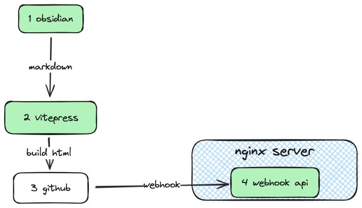
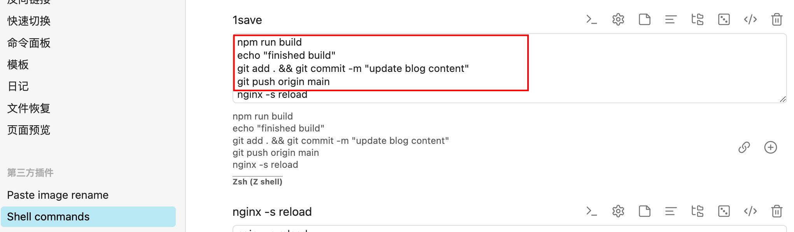

# 引言

在此之前很长时间我都折腾过好几个博客 🥲, 有django + mdui 自建博客; 有wordpress 框架博客...但是我每次回头都会发现, 一年到头没写几篇内容. 
复盘一下, 总得来说来来去去都是一下这几个问题纠缠着: 
1. 写作不方便: 可视化富文本编辑器实在用得难受
2. 发布不方便: 只能用网页进行编辑的话, 流程繁琐
3. 站点访问卡顿:(本人服务器配置是最低档)
4. 习惯难以养成: 自己虽然说有写笔记的习惯, 但是并没有打开网页写文章的习惯, 加上(1,2,3的难受用户体验, 进一步在开头的热情结束后, 打消了自己写东西的热情)  
---
刚好, 今年2024年开头, 我发现了一个不错的笔记应用obsidian, 初步体验下来, 我直接放弃了notion (使用notion的时候遇到了上面列出来的问题).  并且机缘巧合查阅资料之时, 也让我看到了vitepress 博客, 于是两者一拍即合, 有了新文章和这个新博客.


# 思路 
组合的流程结构图如下:  


## vitepress  
可以基于markdown 生成静态博客页面的简约框架, 我很喜欢他简洁朴素的主题风格. 可以清晰简洁舒适的展示markdown文章内容, 部署模式,可以build成dist静态资源. 方便部署在轻量级的服务器上.

## Obsidian  
markdown的笔记应用, 很好用.然后他还支持很多插件.
此处通过电脑客户端上安装obsidian `shell commands`插件, 配置好一键执行的命令, 使用起来就可以很方便了, 我配置的命令如下:  

命令解释: 
触发本地同文件夹下的vitepress对markdown进行编译, 然后提交到github上, 
再开启`/`斜杠触发重新构建和push到github, 一键操作了, 非常的方便!

## github  
github的仓库既可以作为云备份用, 也可以作为触发器, 利用其上的webhook功能, 再检测到push命令的时候, 给`博客服务器`发送webhook 信息请求. 然后触发`博客服务器`上进行拉取和更新操作.  
服务器上的简单webhook重启接收端, 我直接编写了一个基于flask简单服务, 功能很简单,就是提来git最新代码(博文静态文件), 然后复制到指定位置, 让nginx重载,完成更新.

## Nginx  
作为一个高性能静态页面服务器, 用起来也是非常的简单和容易, 特别对于我这种,博客服务器配置非常低的使用者来说, 以前的wordpress/ django, 都需要安装数据库, 或者占用很多资源, 安装很多环境依赖, 有了nginx + vitepress 就不需要考虑这么多了. 直接让他处理vitepress build后的dist博客静态资源, 简直舒服. 
nginx配置也很简单, 安装好后, nginx 即可启动. 
```nginx
server {  
    listen 80;  
    server_name [yourdomain.com](https://yourdomain.com/ "https://yourdomain.com"); # 将此处换成你的域名或者公网 IP  
  
    location / {  
        root /var/www/blog/dist; # 将此处修改为你的博客静态页面存放的路径  
        index index.html; # 设定默认访问的网页文件  
        try_files $uri $uri/ =404; # 按请求的URI来寻找文件，找不到则返回404  
    }  
}

```
更新推送也只需要`nginx -s reload`就可以完成. 

## 总结 

obsidian 写笔记/博文 --> vitepress build --> github --> nginx.  
详细请查看仓库代码. 体验非常简单和舒服! 这下没有理由不输出文章了🤡hhh...

拓展:  
obsidian的`shell commands`插件可以自定义执行cmd命令. 所以,一切皆有可能, 比如后续如果有多平台的发文需求, 那直接编写好对应平台的发文的自动化代码, 然后,只需要在 `shell command`中增加一条触发命令就可以了. 真正做到, 一键写文/ 发文! 


>[realzhengyiming/YiMingBlog: a... new blog again](https://github.com/realzhengyiming/YiMingBlog)
