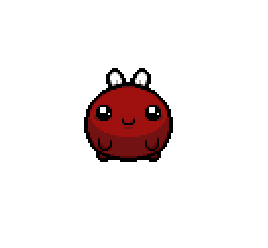

<BabyPulm />

# 引言  
前端的所见即所得, 还是很有意思的. 作为程序员, 没理由拒绝了解各种技术的机会. 这不, 这段时间看以撒的wiki看得多, 然后看到“梅糖宝宝”这个boss在网页上竟然有个动画角色, 点击还会跑, 还带交互和丰富的动画(和游戏中一样).这就让我产生了兴趣. 突然对前端控制动画的功能和原理有兴趣了.  特别是之前我还特别看过一下godot框架的动画.  
然后又想到, vitepress是支持自定义vue组件的, 然后动画的功能应该不需要和后端交互, 就想着干脆了解一下vue组件, 还有前端css动画. 看看能不能也给自己的vitepress博客也增加一个这样小动画组件, 感觉很有趣.  

---

## 前端动画  

之前我小研究过一下godot游戏框架, 那时候看2d游戏的动作功能, 它就是通过逐帧图片或者雪碧sprite(也是逐帧)去配置不同动作动画, 然后按照设定播放而成的实现2d角色的动画功能的.     

经过查阅, 前端实现动画大体上也是走逐帧动画的思路.  
总结起来目前有几种实现的:   
1. gif
2. js控制切换帧动画
3. css3动画
4. css动画 + js切换不同的状态
5. 其它框架(基本原理是一致的, 不展开)

### gif 
优点: 可以由视频直接转化, 互联网上拥有大量的gif, 容易获得, 成本低  
缺点: 支持的颜色空间有限(最大256色), 对alpha支持差, 没法独立控制播放, 暂停  

### js控制切换动画
这个方案开始就是直接的帧动画控制了, 此处是通过, 原理是通过图片设置成background, 然后通过改变`background-position`来逐帧显示子图.  
优点:兼容性好, 交互行灵活  
缺点:编写不那么方便  

### CSS3动画
css3animation主要是围绕 `steps(number_of_steps, direction)`带有了逐帧动画连续播放的功能来实现自动的播放动画. 通过读取雪碧图, 配置好每秒播放哪些关键帧, 修改 `background-position` 的值来实现帧动画的切换.  
优点: 使用广泛, 兼容性好, 相比纯js, 写起来简单很多  
缺点: css是固定, 只能固定播放   

### CSS3动画+js  
这两种组合起来就几乎能灵活的满足复杂的动作变化的需求了. 比如`idle`, `move`, `attack`三种动作, 只需要先通过CSS3配置好不同逐帧动画的`className`. 然后再通过js编写不同的触发器, 通过触发器改变动画标签的`className`的值, 就可以实现流畅方便的复杂动画的组合和变化. 此次wiki上看到那种就是使用这种方法.  

## vue组件 
>Vue (发音为 /vjuː/，类似 **view**) 是一款用于构建用户界面的 JavaScript 框架。它基于标准 HTML、CSS 和 JavaScript 构建，并提供了一套声明式的、组件化的编程模型，帮助你高效地开发用户界面。无论是简单还是复杂的界面，Vue 都可以胜任。   ---  vue 官方介绍  

之所以看这个是因为vitepress博客是基于vue的, 并且支持使用vue去自定义和拓展页面的功能, 所以也需要了解一下这个(本人非前端专业).   

用我消化后的理解讲, vue是其中一种可以方便的把`html`, `js`,`css` “封装”成类似小模块的代码形式, 方便了复杂前端项目的维护和管理的一个前端框架. vue组件就是vue封装子模块的子模块的叫法.  了解到此, 感觉就够用了, 也觉得非常棒, 可以更加方便的管理和使用自己的编写好的小功能/样式/组件了, 确实好用.     

## 编写Vue组件动画代码  

### 提取静态资源&整理html代码  
**免责声明**: 只用于分享和学习, 不用与盈利.   
因为我很喜欢"梅糖宝宝"这个角色, 所以接下来的演示, 我直接从wiki上把帧动画的雪碧图和资源扣下来进行用了.😆    
```html
<html>  
  
<head>  
    <link rel="stylesheet" type="text/css" href="./animate.css">  
</head>  
<div style="z-index:1000;position: absolute; left: 0px; top: 0px; transform: translate(400.484px, 400.938px);" class=""  
     onclick="change_status()">  
    <div id="baby_plum" class="baby_plum_anim baby_plum_anm_Idle" style="position: absolute; left: 0px; top: 0px;">  
    </div></div>  
<script>  
    let isIdle = true; // 判断是否是静候  
    let isClick = false;  
    const babyPlumAnimElement = document.getElementById('baby_plum');  
    babyPlumAnimElement.addEventListener("mouseover", function () {  
        //鼠标悬停就打招呼, 不然就idel  
        babyPlumAnimElement.classList.remove('baby_plum_anm_Idle');  
        babyPlumAnimElement.classList.add('baby_plum_anm_HelloLoop');  
    });  
    babyPlumAnimElement.addEventListener("mouseout", function () {  
        babyPlumAnimElement.classList.remove('baby_plum_anm_HelloLoop');  
        babyPlumAnimElement.classList.add('baby_plum_anm_Idle');  
    });  
  
    function change_status() {  
        babyPlumAnimElement.className = "baby_plum_anim";  
        isIdle = false;  
        isClick = true;  
        var status = babyPlumAnimElement.className;  
        console.log(status);  
        console.log(babyPlumAnimElement.classList);  
  
        // 如果不是就执行移动的操作, 随机移动到某个位置上, 执行 attack  
        babyPlumAnimElement.classList.remove('baby_plum_anm_Idle');  
        babyPlumAnimElement.classList.add('baby_plum_anm_Attack1');  
  
        setTimeout(() => {  
            babyPlumAnimElement.classList.remove('baby_plum_anm_Attack1');  
            babyPlumAnimElement.classList.add('baby_plum_anm_Idle');  
        }, 1000)  
  
        // 移动到新的坐标以后, 才停止这个动画, 转换回 idle  
        isIdle = true;  
        isClick = false;  
        console.log(babyPlumAnimElement.classList);  
    }  
</script>  

  
</html>
```
此处我简单的抽取了雪碧图, 抽取了`idle`, `attack`, `hello` css3 className对应的代码, 并且编写监听器, 配置好了3个不同的动作交互. 然后直接浏览器中打开.   



😆正常工作, 获得一只会动的梅糖宝宝. 然后再把它改写成vue组件的形式.  
```vue
<template>  
  <div :style="mainDivStyles" @click="changeStatus">  
    <div id="baby_plum" :class="['baby_plum_anim', babyPlumClass]" :style="babyPlumStyles" @mouseover="mouseoverHandler"  
      @mouseout="mouseoutHandler" @animationend="animationEndHandler">  
    </div>  </div></template>  
  <script>  
// 点击后生成新的坐标位置, 随机  
  
export default {  
  data() {  
    return {  
      isIdle: true,  
      isClick: false,  
      babyPlumClass: 'baby_plum_anm_Idle',  
      mainDivStyles: {  
        zIndex: 1000,  
        position: 'absolute',  
        left: '0px',  
        top: '0px',  
        transform: 'translate(100.484px, 200.938px)',  
        transition: 'transform 2s', // 定义动画效果  
      },  
      babyPlumStyles: {  
        position: 'absolute',  
        left: '0px',  
        top: '0px',  
      },  
      targetPosition: { x: 100.484, y: 200.938 }, // 结束动画后的目标位置  
    };  
  },  
  methods: {  
    mouseoverHandler() {  
      this.babyPlumClass = 'baby_plum_anm_HelloLoop';  
    },  
    mouseoutHandler() {  
      this.babyPlumClass = 'baby_plum_anm_Idle';  
    },  
    changeStatus() {  
      this.isIdle = false;  
      this.isClick = true;  
      this.babyPlumClass = 'baby_plum_anm_Attack1';  
  
      // 1 更新目标位置，然后修改transform效果  
      this.targetPosition.x = Math.random() * window.innerWidth - 128 / 2;  // 将目标坐标设为新的位置  
      this.targetPosition.y = Math.random() * window.innerHeight - 128 / 2;  // 将目标坐标设为新的位置  
      this.mainDivStyles.transform = `translate(${this.targetPosition.x}px, ${this.targetPosition.y}px)`;  
  
      setTimeout(() => {  
        this.babyPlumClass = 'baby_plum_anm_Idle';  
        this.isIdle = true;  
        this.isClick = false;  
      }, 1000);  
    },  
  },  
};  
</script>  
  <style scoped>  
@import './animate.css';  
</style>
```

再在vitepress中全局注册, 就可以全局在markdown中使用了
```ts
// https://vitepress.dev/guide/custom-theme
import { h } from 'vue'
import { VPBTheme } from '@jcamp/vitepress-blog-theme'
import './style.css'
import CustomBlogHeader from './CustomBlogHeader.vue'
import BabyPulm from './baby_pulm.vue'

export default {
  ...VPBTheme,
  Layout: () => {
    return h(VPBTheme.Layout, null, {
      // https://vitepress.dev/guide/extending-default-theme#layout-slots
    })
  },
  enhanceApp({ app, router, siteData }) {
    VPBTheme.enhanceApp({ app, router, siteData })
    app.component('CustomBlogHeader', CustomBlogHeader)
    app.component("BabyPulm", BabyPulm)  // 注册自定义vue组件
  },
}

```
vitepress中使用自定义vue组件也是很简单的.  添加到markdown中即可.
```
<BabyPulm /> 
```

## 效果展示  

效果次文档上已经可以看到了, 此网页上飞来飞去的那只梅糖宝宝就是了 🤣. 感觉还是很有趣的.

相关详细代码查看本博文对应的仓库即可 : 
[realzhengyiming/YiMingBlog: a... new blog again ,:) (github.com)](https://github.com/realzhengyiming/YiMingBlog)

## 总结   
vue组件很好用, vitepress配合他可以实现任何功能了...  

额外收获: 实现这个需求让我体会到了, 前端和游戏开发其实可以说是很相近的. 游戏开发, 2d游戏举例, 本质就是编写不同的控件, 然后给控件配置不同的监听事件, 以此实现各种交互动作. 拿这个动画的功能举例, 一个`多媒体`可交互对象, 那它可以说就是一个**游戏**了. 
相关技术框架:  
[PixiJS](https://pixijs.com/)  
[Electron.。s](https://www.electronjs.org/)   
